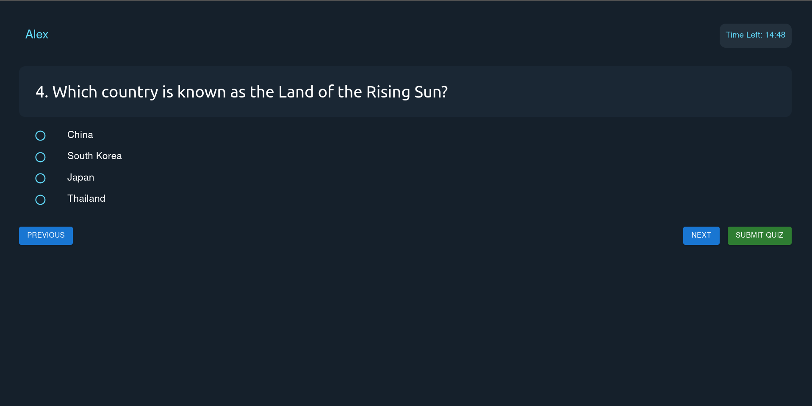

# Django-Quiz-App

A full-stack Quiz App designed to provide users with an interactive quiz experience. The app has a **React-based frontend** and a **Django REST API backend**, ensuring a seamless flow of data and functionality.



---

## Table of Contents

1. [Features](#features)
2. [Tech Stack](#tech-stack)
3. [Backend](#backend)
4. [Frontend](#frontend)
5. [Setup Instructions](#setup-instructions)
6. [Assumptions](#assumptions)

---

## Features

- Interactive quiz interface with questions and options.
- Timer functionality (default 15 minutes).
- Navigation between questions (Next/Previous buttons).
- Submit quiz confirmation modal.
- Dynamic results based on user responses.

---

## Tech Stack

### Backend:
- **Django** (Python 3.12.7)
- **Django REST Framework** for API endpoints.
- **PostgreSQL** for database management (AWS RDS).

### Frontend:
- **React** (React Router for navigation).
- **Material-UI (MUI)** for component styling.
- **Axios** for API requests.

---

## Backend

The backend is built with Django and exposes REST API endpoints to manage quiz-related data.

### Key Features:
1. **API Endpoint:**
   - `GET /api/get-questions/`
     - Fetches the list of quiz questions, including:
       - Question text
       - Options (A, B, C, D)
       - Correct answer (only for internal use).

2. **Database:**
   - The questions are stored in the default SQLlite database.
   - The schema includes fields for question text, options, and the correct answer.

---

## Frontend

The frontend is built using React and Material-UI for a responsive and visually appealing design.

### Key Components:
1. **QuizPage:**
   - Displays questions and options.
   - Includes a timer that automatically submits the quiz upon expiration.
   - Navigation buttons (Next/Previous) styled with custom colors.
   - A "Submit Quiz" button with a neon green glow and confirmation modal.

2. **Result Page:**
   - Displays the user's performance after quiz submission.
   - Shows the correct and incorrect answers.

### API Integration:
- Uses `axios` to fetch questions from the backend.
- Manages user state (selected answers, timer, etc.) locally.

---

## Setup Instructions

### Backend Setup
1. Clone the repository and navigate to the backend folder.
2. Install dependencies:
   ```bash
   pip install -r requirements.txt
   ```
3. Set up the database (PostgreSQL):
   - Update `DATABASES` in `settings.py` with your credentials.
   - Run migrations:
     ```bash
     python manage.py migrate
     ```
4. Start the Django server:
   ```bash
   python manage.py runserver
   ```

### Frontend Setup
1. Navigate to the frontend folder.
2. Install dependencies:
   ```bash
   npm install
   ```
3. Start the React app:
   ```bash
   npm start
   ```

---

## Assumptions

1. **Users:**
   - Users have a unique `userName` passed to the `QuizPage` via React Router `location.state`.
   - Users must finish the quiz in a single session (no persistence of state).

2. **Timer:**
   - The quiz is time-bound (15 minutes by default).
   - If the timer expires, the quiz is auto-submitted.

3. **Questions API:**
   - Assumes the `/api/get-questions/` endpoint returns questions in the following format:
     ```json
     [
       {
         "id": 1,
         "text": "What is the capital of France?",
         "option_a": "Berlin",
         "option_b": "Madrid",
         "option_c": "Paris",
         "option_d": "Rome",
         "correct_option": "C"
       }
     ]
     ```

4. **Navigation:**
   - Users can navigate freely between questions using "Next" and "Previous" buttons.

5. **Submission:**
   - Users must confirm their submission via a modal before results are displayed.

---

Enjoy the app! If you encounter any issues or have suggestions, feel free to contribute or report an issue.

